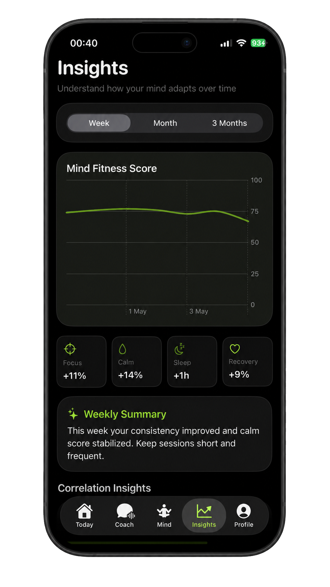
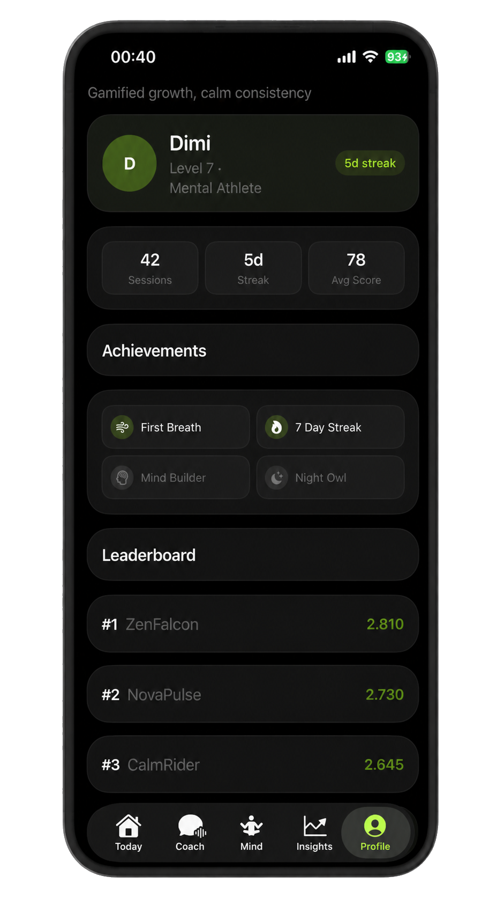
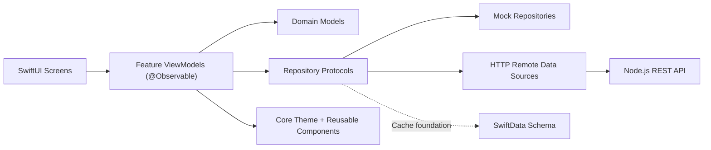

<p align="center">
  
</p>

<h1 align="center">Nuwora Mobile</h1>
<p align="center"><strong>AI-powered mental resilience and cognitive fitness experience for iOS.</strong></p>

<p align="center">
  
  
  
  
  
  
  
</p>

## Overview
Nuwora Mobile is a frontend-first iOS app designed as a daily Mind Gym. It helps users train focus, regulate stress, and build cognitive resilience through a premium, dark, high-contrast UI with guided flows.

This repository currently focuses on product experience and interface quality:
- Polished SwiftUI screens with a shared design system
- Persona-based AI Coach chat experience
- Daily score, monitoring cards, and guided action prompts
- Trend and insight storytelling with visual hierarchy
- Fast local iteration using mock repositories

## Key Experience Highlights
- Three coach personas with clear visual identity: `Zen Monk` (calm grounding), `Peak Performer` (high-energy focus), `Neuroscientist` (analytical clarity)
- Dark and light mode home experience with consistent layout hierarchy
- Real-time monitoring cards (HRV, focus, distraction signals) for quick status scanning
- Weekly insight summaries and trend graph storytelling for behavior feedback loops
- Gamified profile layer (streaks, achievements, leaderboard) to reinforce consistency
- Lightweight, responsive transitions and loading states for a smooth UI feel

## Screenshots

### Home Screen: Dark vs Light
<p align="center">
  
  
</p>

### AI Coach Personas
<p align="center">
  
  
  
</p>

### Additional Screens
<p align="center">
  
  
</p>

## Frontend Architecture
The app is organized with a clean, UI-first MVVM structure. Data access is protocol-driven so UI flows are stable while backend integrations are still in progress.



### Core UI Components
- `NCard`: Shared surface container with border, glow accents, and consistent corner radius for feature blocks
- `NButton`: Unified primary/secondary/ghost button styles aligned with Nuwora visual language
- `NScoreGauge`: Circular mind-score presentation used for high-visibility daily status
- `NProgressRing`: Reusable progress primitive powering score and completion visuals
- `NSkeletonView`: Loading placeholder system for graceful data wait states
- `NToast`: Non-blocking feedback component for info/warning/success events
- `NSceneBackground`: Adaptive layered background system per app scene/tab context
- `MainTabView`: Persistent tab navigation shell with custom styling behavior across sections

### Notable Product Mechanics (Frontend)
- Persona-driven chat theming dynamically recolors coach context and conversation surfaces
- Prompt chips provide low-friction conversation starters inside coach flow
- Safety keyword banner support for sensitive user intent patterns
- Local-first mock data architecture to keep UI development deterministic and fast
- Feature-level `@Observable` view models for predictable screen state and rendering

### Project Layers
- `App/`: App entry, navigation shell, app-level state
- `Features/`: Screen modules (`Home`, `Coach`, `Plan`, `Insights`, `Profile`, `Onboarding`)
- `Components/`: Shared UI building blocks (`NCard`, `NButton`, gauges, skeletons, etc.)
- `Core/`: Theme tokens, background system, utilities
- `Data/`: Models, repositories, mock providers, local persistence setup

## Current Scope
This codebase is currently **frontend-focused**:
- Primary focus is UI, interaction quality, and architecture foundations
- API/LLM production wiring is intentionally not part of this phase
- Mock and local data paths keep iteration fast and deterministic
- The shared Xcode scheme enables `NUWORA_APP_ENV=staging-ready` and connects real repository adapters to `http://127.0.0.1:3000/v1`
- Anonymous API sessions are created automatically and the access token is stored in Keychain
- The exact backend contract is documented in `docs/backend_api_contract.md`

## Run Locally
1. Open `Nuwora Mobile.xcodeproj` in Xcode.
2. Select scheme `Nuwora Mobile`.
3. Run on an iOS Simulator.

The shared scheme expects the local backend at `http://127.0.0.1:3000/v1`. To temporarily run only mock data, disable the `NUWORA_APP_ENV` environment variable in the scheme or set it to `mock`.

Backend handoff:

- API contract: `docs/backend_api_contract.md`
- Claude Code implementation prompt: `docs/CLAUDE_CODE_BACKEND_PROMPT.md`

Build check:

```bash
xcodebuild -project "Nuwora Mobile.xcodeproj" -scheme "Nuwora Mobile" -destination "generic/platform=iOS" build
```

Sandbox-safe local build command:

```bash
./scripts/local_build.sh
```

Sandbox-safe local tests command:

```bash
./scripts/local_test.sh
```

Optional simulator override:

```bash
NUWORA_TEST_DESTINATION="platform=iOS Simulator,name=iPhone 17" ./scripts/local_test.sh
```

## Known Local CI Limitation
- In some local/sandbox environments, `CoreSimulatorService` may be unavailable, which can break simulator-only steps like asset compilation for `iphonesimulator`.
- Use `./scripts/local_build.sh` to validate non-simulator compile paths with local `DerivedData`.
- If simulator runtimes are unavailable, treat simulator smoke tests as blocked by environment and run them as soon as runtime services recover.
- Use `docs/qa_smoke_checklist.md` as the manual regression checklist once simulator services recover.

## Product Direction
- Expand coach intelligence with production AI services
- Connect wearables and behavioral signals via HealthKit
- Add adaptive recommendations based on longitudinal trends
- Keep elevating visual craft across every user flow

---

<p align="center">
  
</p>
<p align="center"><strong>Train calm. Build focus. Stay resilient.</strong><br/>Nuwora is your daily practice space for a stronger mind.</p>
