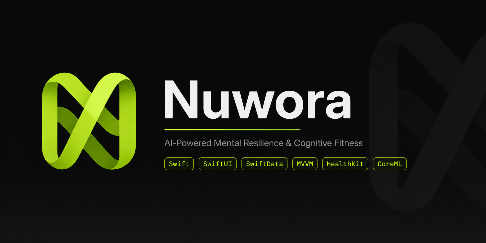
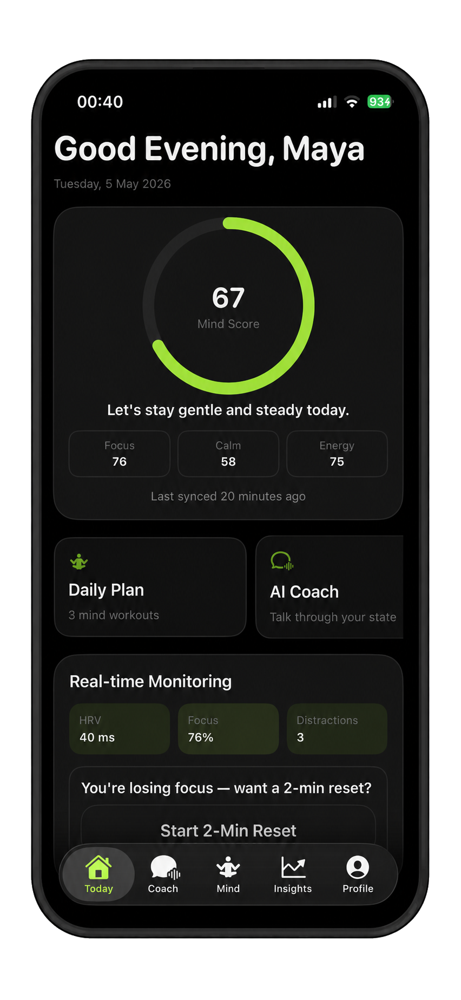
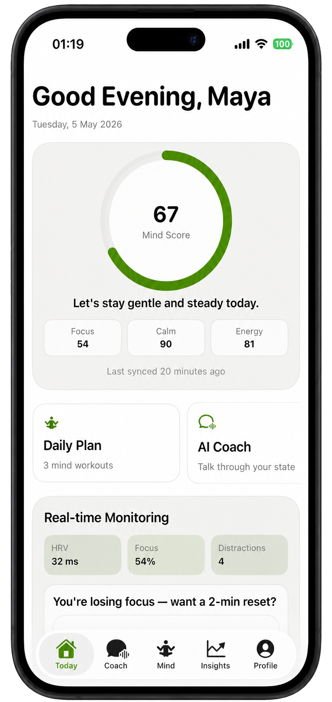
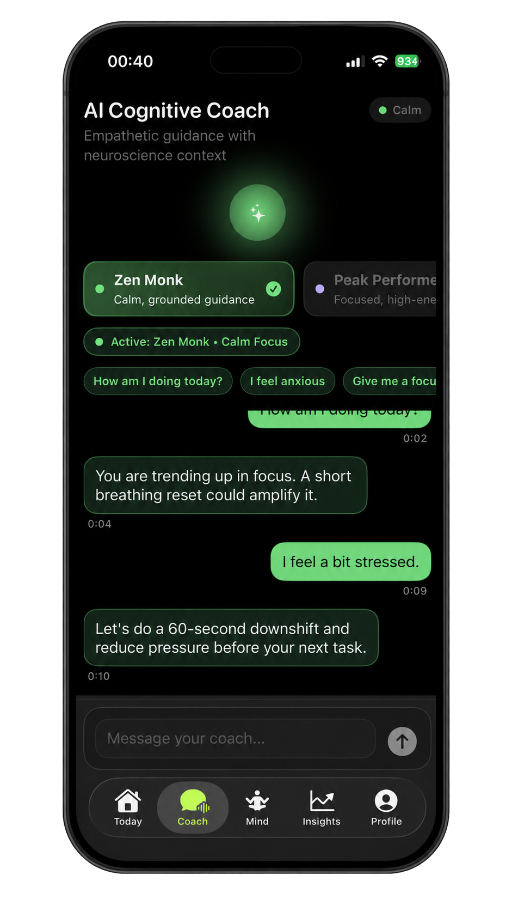
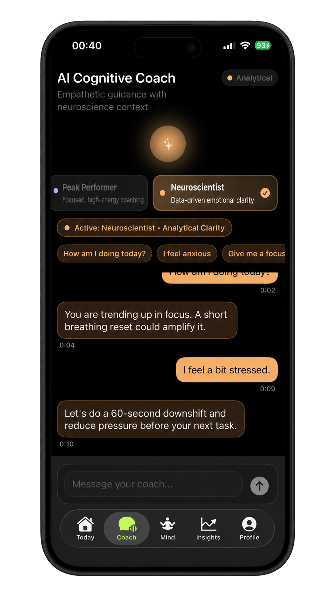
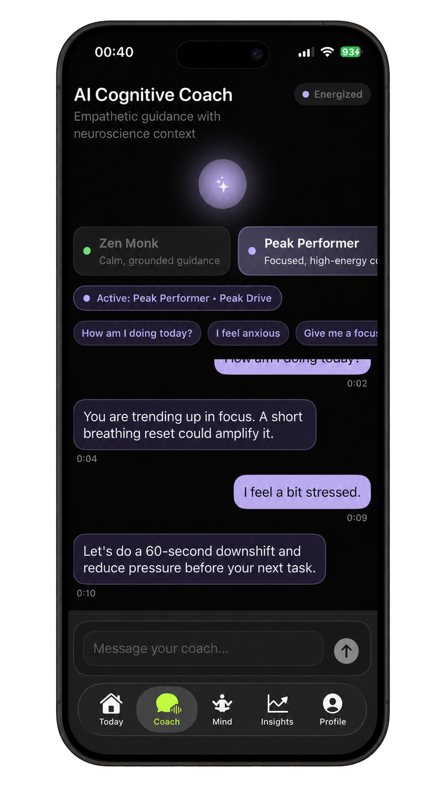
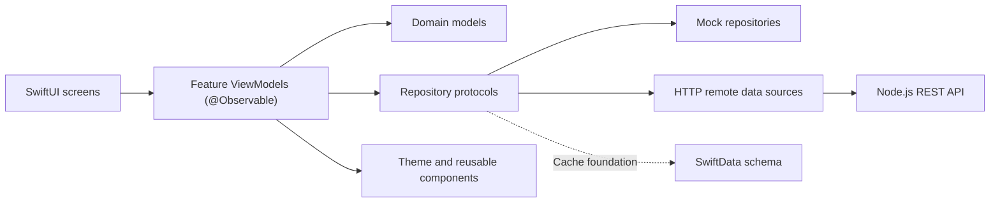
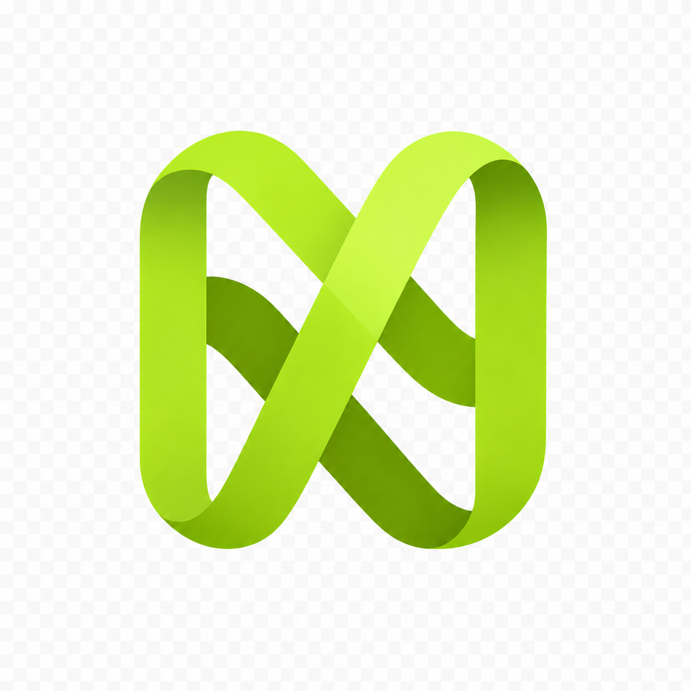

<p align="center">
  
</p>

<h1 align="center">Nuwora</h1>
<p align="center"><strong>AI-powered mental resilience and cognitive fitness experience for iOS.</strong></p>

<p align="center">
  
  
  
  
</p>

<p align="center">
  <strong>Authors:</strong> Dimitrije Milenković · Nemanja Vidić · Stevan Stojanović
</p>

Nuwora is a daily Mind Gym: an iOS app for training focus, regulating stress,
and building cognitive resilience. The repository contains both the SwiftUI iOS
client and its Node.js REST API.

## Repository layout

```text
Nuwora/
├── Nuwora-Mobile-main/  # SwiftUI iOS app
└── Backend/             # Express, Prisma, and PostgreSQL API
```

## Quick start

Start the API first. Docker Compose builds the API, starts PostgreSQL, applies
migrations, and seeds the demo data.

```bash
cd Backend
docker compose up --build
```

The API is then available at `http://127.0.0.1:3000`, with routes under
`/v1`, and the health endpoint at `http://127.0.0.1:3000/health`.

Next, open `Nuwora-Mobile-main/Nuwora Mobile.xcodeproj` in Xcode, select the
`Nuwora Mobile` scheme, and run it on an iOS Simulator. The shared scheme
uses `http://127.0.0.1:3000/v1` and automatically creates an anonymous API
session, storing its access token in Keychain.

To use mock data only, set `NUWORA_APP_ENV=mock` (or disable that environment
variable) in the Xcode scheme.

## Mobile app

The iOS app is built with Swift 5.9+, SwiftUI, SwiftData, and a UI-first MVVM
architecture. It provides a dark, high-contrast experience with guided daily
flows, local-first iteration, and remote repository adapters for the API.

### Key experience highlights

- Three coach personas: `Zen Monk` (calm grounding), `Peak Performer`
  (high-energy focus), and `Neuroscientist` (analytical clarity).
- Daily score, monitoring cards, guided prompts, trend insights, streaks,
  achievements, and a leaderboard.
- Shared design-system components for cards, buttons, score gauges, progress,
  skeleton loading states, and toast feedback.
- Persona-aware coach chat, prompt chips, and safety-keyword banner support.

### Screenshots

<p align="center">
  
  
</p>

<p align="center">
  
  
  
</p>

### Mobile architecture



Key folders in `Nuwora-Mobile-main/Nuwora Mobile/`:

- `Features/` — onboarding, authentication, dashboard, coach, plan,
  analytics, and gamification screens.
- `Components/` — `NCard`, `NButton`, `NScoreGauge`, `NProgressRing`,
  `NSkeletonView`, and `NToast`.
- `Data/` — models, repositories, remote sources, mock data, and SwiftData.

### Build and test the app

```bash
cd Nuwora-Mobile-main
xcodebuild -project "Nuwora Mobile.xcodeproj" -scheme "Nuwora Mobile" -destination "generic/platform=iOS" build
./scripts/local_build.sh
./scripts/local_test.sh
```

For a simulator override:

```bash
NUWORA_TEST_DESTINATION="platform=iOS Simulator,name=iPhone 17" ./scripts/local_test.sh
```

Some local or sandbox environments may not have `CoreSimulatorService`
available. In that case, use `./scripts/local_build.sh` for a non-simulator
compile check, then run the simulator smoke tests when the service is
available. See the [manual QA checklist](Nuwora-Mobile-main/docs/qa_smoke_checklist.md).

## Backend API

The API uses Express 4, TypeScript, Prisma, PostgreSQL, Zod, JWT bearer
authentication, Pino structured logging, Vitest, and Supertest. It follows the
[mobile API contract](Nuwora-Mobile-main/docs/backend_api_contract.md): exact
JSON field names, enums, status codes, date format, and direct arrays for
list responses.

### Authentication

All authentication endpoints return
`{ accessToken, user: { id, isNewUser } }`.

- `POST /v1/auth/anonymous` — accepts `{ deviceID }`; the same device resolves
  to the same user.
- `POST /v1/auth/register` — accepts `{ email, password }`; passwords must be
  at least 8 characters and existing email addresses return `409 CONFLICT`.
- `POST /v1/auth/login` — accepts `{ email, password }`; invalid credentials
  return a generic `401 UNAUTHORIZED` response.

Passwords are bcrypt-hashed and never logged. Every new user gets two welcome
messages in the Coach history.

### Local, non-Docker development

Requires Node.js 20+ and PostgreSQL.

```bash
cd Backend
npm install
cp .env.example .env
# Edit DATABASE_URL and JWT_SECRET as needed.
npm run prisma:migrate:dev
npm run seed
npm run dev
```

### Database, tests, and quality checks

```bash
cd Backend
npm run prisma:migrate:dev --name <change_description>
npm run prisma:migrate:deploy
npm run prisma:studio
npm run seed
npm run test:unit
npm run test:integration
npm test
npm run typecheck
npm run lint
npm run format:check
```

Integration tests use the separate `nuwora_test` PostgreSQL schema. Start the
database for them with `docker compose up -d postgres`. To reset local data,
run `npm run db:reset`; to reset the Docker database volume, run
`docker compose down -v` followed by `docker compose up --build`.

Environment configuration is documented in [Backend/.env.example](Backend/.env.example).
The required variables are `DATABASE_URL`, `JWT_SECRET` (16+ characters),
`PORT`, `JWT_EXPIRES_IN`, and `CORS_ORIGINS`.

### Backend architecture and behavior

```text
Backend/src/
├── app.ts, index.ts       Express app assembly and graceful shutdown
├── domain/                XP, streak, achievements, coach personas, dates
├── lib/                   Prisma, JWT, idempotency, and app errors
├── middleware/            Auth, validation, request ID, and error handling
└── modules/               Feature routers, schemas, services, serializers
Backend/prisma/            Schema, migrations, and idempotent seed data
Backend/tests/             Unit and full HTTP integration tests
```

- Mood check-ins, exercise completion/skips, and coach messages use
  `clientMutationID` idempotency, so retries never duplicate XP, streaks, or
  chat messages.
- `level = 1 + floor(xp / 500)`.
- Streaks increment only for the first completed exercise on a consecutive
  UTC day; a gap resets the streak to 1.
- `GET /plans/today` provides a stable daily set of 3–5 exercises.
- `GET /dashboard` combines the latest score, plan items, streak, level, and
  XP progress.
- Achievements unlock based on stored exercise, streak, mood, and level stats.

The seeded catalog includes five exercise types, four achievements, six demo
leaderboard users, and 90 days of score history for analytics.

## Current scope and direction

The product currently emphasizes polished UI, deterministic local development,
and a complete minimal REST contract. Coach responses are deterministic,
persona-keyed phrase pools behind a replaceable `CoachResponder` interface;
they are not yet LLM-backed. HealthKit ingestion, subscriptions, Sign in with
Apple, push notifications, collaboration integrations, and production AI are
future work.

<p align="center">
  
</p>
<p align="center"><strong>Train calm. Build focus. Stay resilient.</strong></p>

---

## Authors

| Name | Role |
|---|---|
| **Dimitrije Milenković** | Mobile (iOS/SwiftUI) & Backend Architecture |
| **Nemanja Vidić** | Backend & ML |
| **Stevan Stojanović** | Backend |
